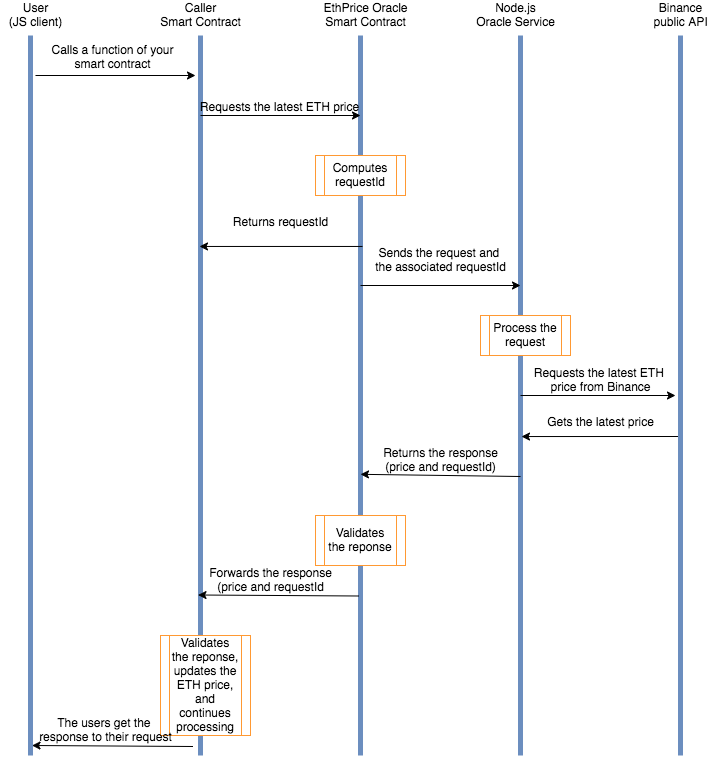

# ETH Price Oracle

This is a simple implementation of an oracle written in Solidity and JavaScript. There are two contracts, the `Caller` and the `EthPriceOracle`. There is a backend service hitting the Binance API for the current ETH/USD price and submitting that to the `EthPriceOracle`. The oracle contract then sets the price onchain and invokes the callback method from `Caller`, which handles the request queue.

Requests to get the ETH price in USD is handled via the `Caller` contract. This maps all incoming requests to particular request IDs and processes them accordingly, ensuring that requests are tracked across both contracts.

The client sends an onchain request on an interval, and the backend service processes the requests in batches within a queue on an interval. This enables continual pinging of the Binance API and updating the value of ETH in USD onchain to stay in sync per this interval.

Here is a simple workflow for this oracle design for each client request:

You can read more about the Basic Request Model at the [Chainlink docs](https://docs.chain.link/architecture-overview/architecture-request-model).